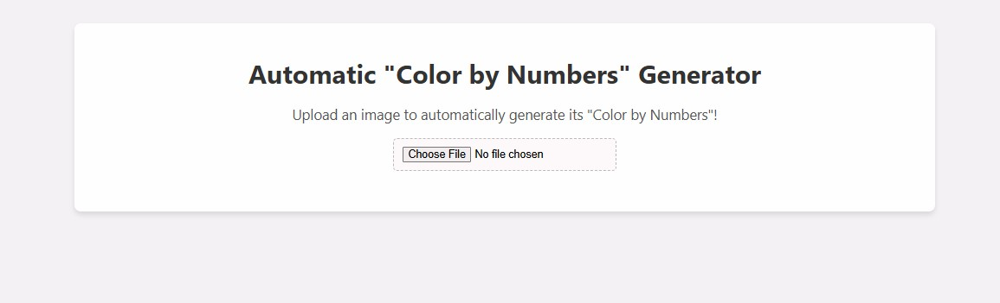
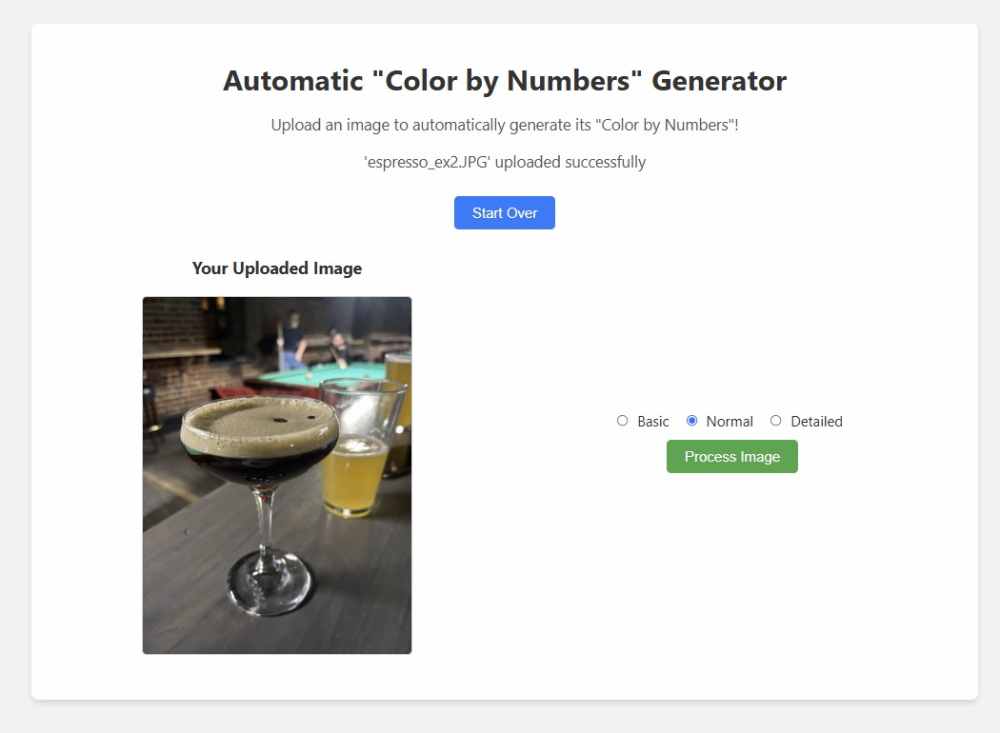
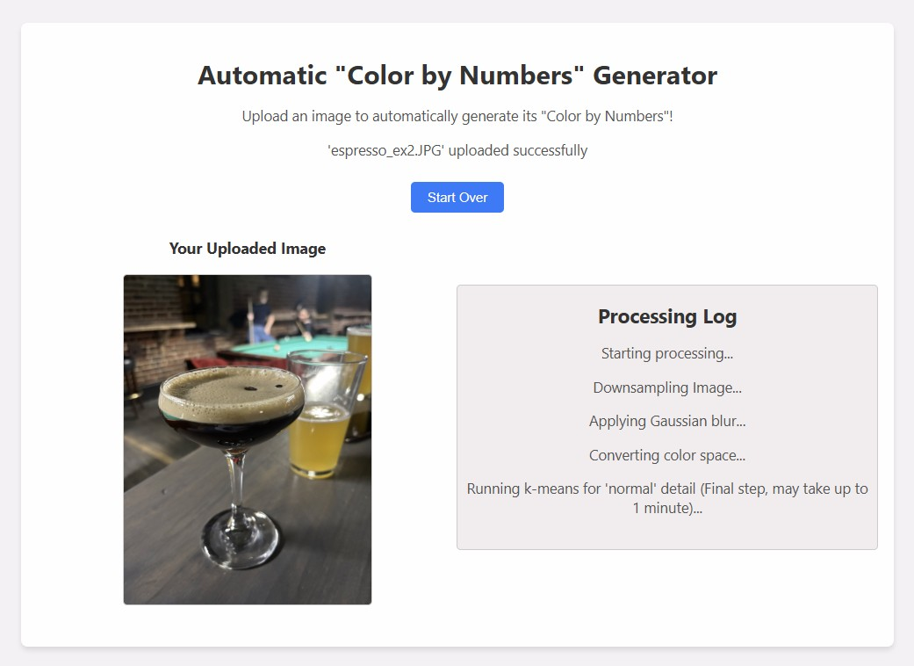
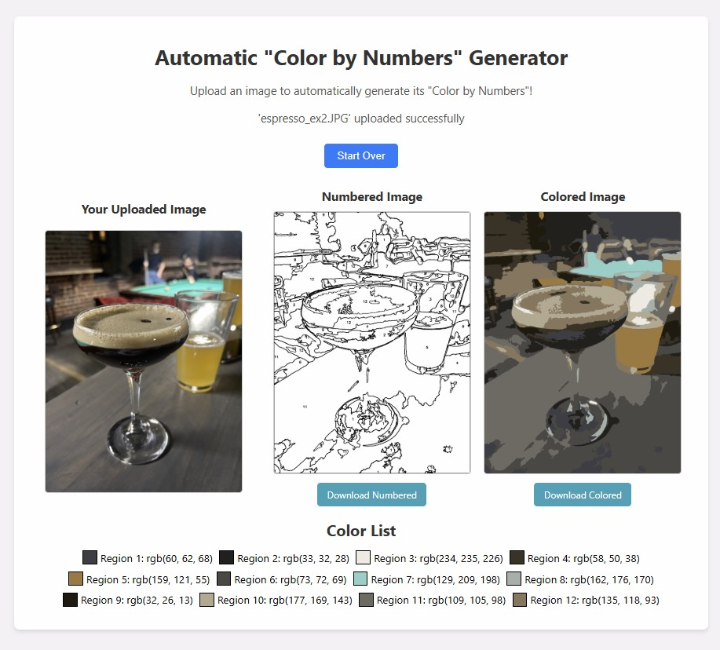

# Auto "Color by Numbers" Generator

Auto Color by Numbers is a computer vision project that transforms any input image into a "color by numbers" style output. The application segments the image into distinct color regions, outlines each region with a unique number, and generates a master list mapping these numbers to their representative RGB colors. A web interface built with Flask allows users to upload images, choose the level of detail, and view/download the processed results.

## Screenshots / Examples


- **Screenshot 1:** Home page with intuitive image upload.

- **Screenshot 2:** Detail level selection.

- **Screenshot 2:** Processing log with live updates.

- **Screenshot 3:** Final output displaying the numbered image, colored preview, and master color list.



## How It Works

1. **Image Preprocessing:**  
   - The image is blurred to smooth out small details.

2. **Color Segmentation:**  
   - The image is converted to the HSV color space.
   - k-Means clustering segments the image into color regions, with the level of detail controlled by the value of *k*.

3. **Post-Processing:**  
   - Small regions are merged or removed.
   - Each region is outlined and labeled with a unique number.
   - A master list of region numbers and their corresponding average RGB colors is generated.

4. **Output Generation:**  
   - A "numbered" image with outlined regions and overlaid numbers is created.
   - A colored preview image is generated to show how the regions look when filled with their representative colors.
   - Both images are available for download.

## Try It Out! (How to Run Locally)

### Prerequisites

- Python 3.x
- [pip](https://pip.pypa.io/en/stable/)

### Setup

1. **Clone the Repository:**

   ```bash
   git clone https://github.com/alexholland4/auto-color-by-numbers.git
   cd auto-color-by-numbers

2. **Create a Virtual Environment (Optional but recommended):**

   ```bash
   python -m venv venv
   source venv/bin/activate   # On Windows use: venv\Scripts\activate
   
3. **Install Dependencies:**

   ```bash
   pip install -r requirements.txt

4. **Run the Flask App:**

   ```bash
   python app.py

5. **Open Your Browser:**
   Navigate to http://localhost:5000 to use the web app.


## Author

Feel free to submit a pull request for any updates, or contact the author, Alex Holland, at hello@alexholland.tech for any further questions.
